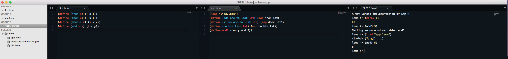

# Project Leme

My own little Scheme, adapted from the brilliant instructions at [WYSAS](https://en.wikibooks.org/wiki/Write_Yourself_a_Scheme_in_48_Hours).

## Build

```
cabal build

# copy standard library to /opt/leme
mkdir -P /opt/leme && cp stdlib.scm /opt/leme
```

## Usage

Assuming that you have put the executable binary obtained from `cabal build` in your `$PATH`, run the standalone REPL

```
leme
```

Or give it a main file and optionally some arguments

```
leme factorial.leme 10
```

## Development Tools

Right now there is some primitive support for Sublime Text and SublimeREPL inside [tools directory](tools/Sublime).



## Roadmap

Version 1.0 is pretty much a verbatim copy from WYSAS. The goal for [version 2.0](https://github.com/limdauto/leme/milestones/v2.0)
is better build, distribution and a richer standard library, including string manipulation and networking.

